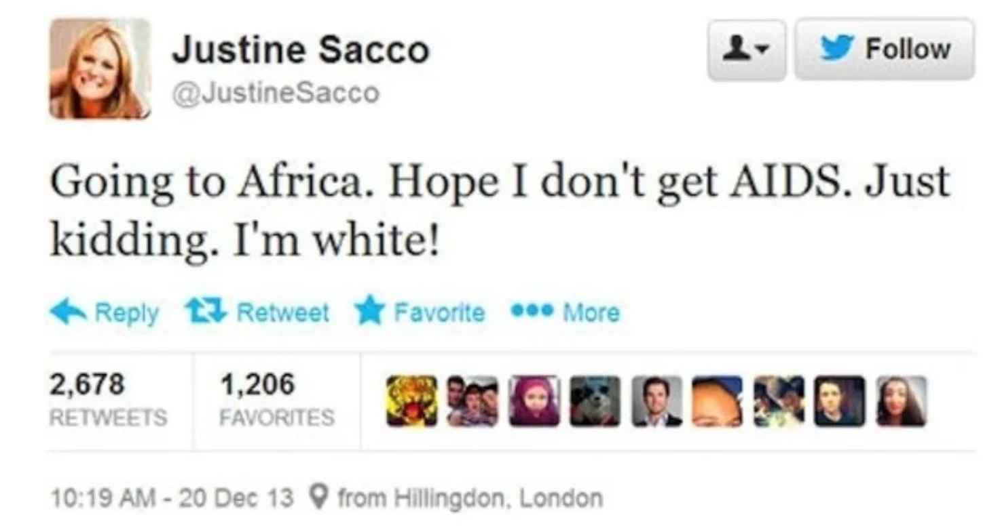
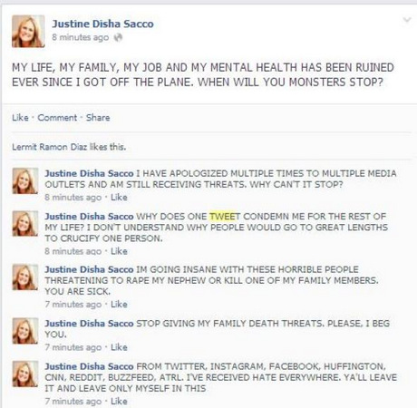
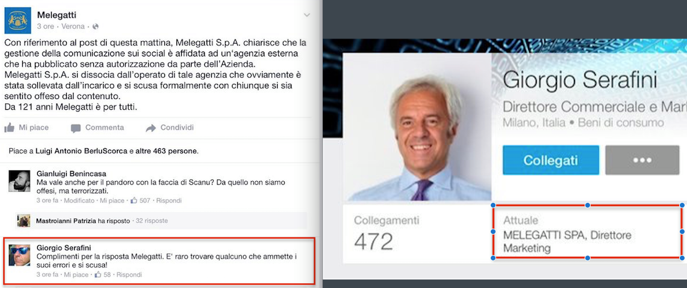
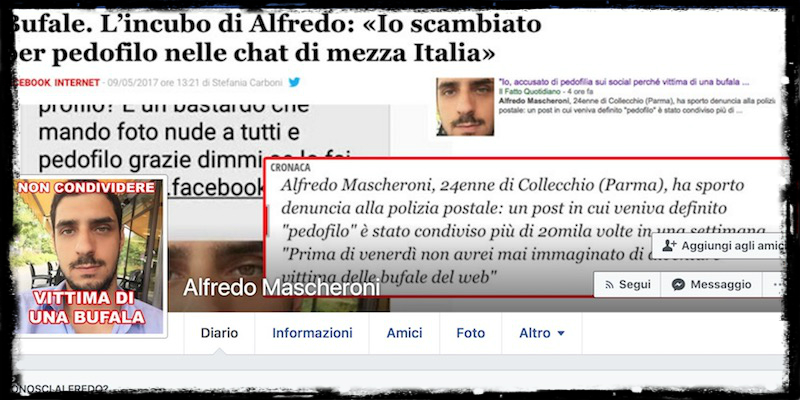

# Identità e reputazione digitale

Che impatti ha la rete sulla reputazione

<!-- _paginate: false -->
<!-- _footer: "" -->
<!-- style: "
img[alt~='center'] {
  display: block;
  margin: 0 auto;
}
" -->

---

## Cosa voglio spiegare

Queste slide sono nate per sintetizzare un intervento di Matteo Flora al Forum al Wired Next Fest

Ho rivolto poi molta attenzione alla possibilità di estendere ed approfondire alcuni concetti, offrendo così la possibilità a chi desiderasse conoscere più a fondo questi argomenti di approfittare di questi spunti.

---

## Cos'è l'identità digitale?

L'identità digitale è la rappresentazione online di un individuo, costituita dalle informazioni, attività e relazioni associate a una persona in Internet.

In Italia lo SPID

---

## Cosa formano l'identità digitale?

Dati e metadati generati dall'utente.

---

## Cos'è la reputazione digitale?

La reputazione digitale è la percezione o opinione che gli altri hanno di un individuo in base alle sue attività, informazioni e dati pubblici online.

---

## La reputazione è una percezione

La reputazione è il contrario di identità: è quello che dicono gli altri di te.

La reputazione non si sovrappone alla verità: la reputazione si subisce, posso in parte condizionarla, ma è la sommatoria delle mie reputazioni che possono essere diverse.

Il processo di reputazione è subito da parte dei soggetti.

---

## Gestione dell'identità e della reputazione

L'identità la posso gestire, la reputazione si subisce.

---

## Internet never forget

Tutto ciò che pubblichiamo online può essere indelebile e conservato a lungo, anche se cerchiamo di cancellarlo.

Ad esempio, un post offensivo che pubblichiamo su un social network quando eravamo adolescenti potrebbe tornare a perseguitarci molti anni dopo quando cerchiamo lavoro o manteniamo relazioni professionali.

---

## Rovinare la reputazione digitale

In modo molto semplice posso rovinare la mia reputazione online

---

## Correggere un errore di reputazione

- Costoso
- Doloroso
- Il risultato finale non è mai lo stesso da cui partiamo

---

## Caso Justine Sacco

Una vita rovinata per un semplice tweet

Justine Sacco era un'executive di PR che ha twittato un tweet razzista prima di un volo per l'Africa nel 2013. Il tweet è diventato virale e ha causato una crisi di pubbliche relazioni per Sacco. È stato licenziata dalla sua posizione e ha ricevuto una fortissima critica sui social media.

---

"Sto andando in Africa. Spero di non prendere l'AIDS. Scherzo. Sono bianca!"

---

Una volta arrivata in Africa, riaccende il cellulare e il mondo è contro di lei.

---

## Il caso Melegatti

Melegatti propone una campagna pubblicitaria non inclusiva.

Il messaggio è stato criticato perché suggerendo che l'amore verso una persona LGBT+ fosse solo un atto di tolleranza da parte degli eterosessuali.

---

---

## Le scuse di Melegatti

Il fail di Giorgio Serafini dove si complimenta con Melegatti per le scuse.

---

## Disastro amplificato

"Melegatti, nuovo disastro del direttore marketing: si "finge" cliente e fa i complimenti al gruppo. Ma viene smascherato"

<https://www.liberoquotidiano.it/news/sfoglio/11851324/Melegatti--nuovo-disastro-del-direttore.html>

---

## Da crisi del web a crisi reputazionale

---

## Il caso di Alfredo Mascheroni

Una bufala lo definisce come un pedofilo

---

## Non siamo strutturati per avere un ufficio stampa personale

Accadono migliaia di cose attorno a noi e senza un adeguato supporto non possiamo scovarle e gestirle.

---

## Dieselgate

Lo scandalo sulle emissioni della Volkswagen, anche noto come Dieselgate o Emissiongate, è stato un episodio di cronaca che ha riguardato la scoperta della falsificazione delle emissioni di automobili munite di motore diesel del gruppo Volkswagen vendute negli Stati Uniti d'America e in Europa.

---

## Emissioni falsificate

Lo scandalo è iniziato nel settembre 2015, quando l'Agenzia statunitense per la protezione dell'ambiente (EPA o USEPA) ha notificato alla multinazionale tedesca del gruppo Volkswagen un'avviso di violazione del Clean Air Act, la legislazione degli Stati Uniti sulla qualità dell'aria. L'Agenzia trovò che la Volkswagen avesse intenzionalmente __progettato i propri motori diesel__ Turbocharged Direct Injection (TDI) __affinché attivassero i sistemi di controllo delle emissioni solamente durante i test di controllo delle emissioni__. Ciò aveva lo scopo di fare in modo che l'emissione di ossidi di azoto (NOx) dei veicoli entro i limiti prescritti dalla legislazione statunitense. I veicoli coinvolti sul banco di prova avevano emissioni in linea con le prescrizioni legali statunitensi grazie al software della centralina appositamente modificato per essere in grado di ridurre le emissioni a scapito di altre prestazioni durante i test di omologazione, migliorando le prestazioni a scapito dei vincoli ambientali durante il normale funzionamento.

---

## Meme

---

## Ingegneri

Da quel momenti in poi, essendo stati gli ingegneri Volkswagen a progettare questo meccanismo di modifica delle emissioni, qualsiasi ingegnere collegato a qualsiasi settore produttivo Volkswagen, subiva una visione distorta per la quale: "Hai lavorato in Volkswagen, allora fai parte di quegli ingegneri che hanno volutamente alterato i motori TDI"

Si subiscono eventi indiretti.

---

## Lista Falciani

La lista Falciani è una serie di informazioni rubate su una vasta rete di clienti privati presuntamente evasori fiscali di alcune divisioni del gruppo HSBC.

Il furto è stato commesso da Herve Falciani, un ex tecnico IT della banca, nel 2006 e le informazioni sono state condivise con le autorità fiscali in diversi paesi.

Esistono dinastie che hanno patrimoni nascosti da decine di anni che si sono trovate, loro malgrado, esposte da un singolo evento di pubblicazione di informazioni riservate.

---

## Panama Papers

I Panama Papers sono milioni di documenti confidenziali che apparvero nel 2016 e mostrano come varie celebrità, rappresentanti politici e aziende abbiano utilizzato società offshore e para-fiscali per evadere le tasse.
migliaia di conti off shore con fiduciario con vero beneficiario.

---

## In futuro ognuno di noi sarà famoso per 15 minuti

E se nei 15 minuti sarai descritto come un pedofilo?

E sei tuoi 15 minuti sbotti in diretta nazionale?

"Le fettine di vitello non ti vanno bene?"

---

## Estote parati

Siate pronti

---

## Processi reputazionali

I Processi reputazionali sono azioni legali o extra-legali intraprese per proteggere la reputazione di un individuo, organizzazione o prodotto. Questo può includere la diffusione di false informazioni, la censura di commenti negativi sui social media o l'avanzamento di cause legali per diffamazione.

--

## Cosa devo fare?

- Capisco cosa dicono di me: faccio ego surfing, devo capire cosa dice la rete di me
- Gestisco delle presenze dove posso parlare
- Costruisco fra i miei primi livelli un presidio dove parlare: linkedin, account social
- Parlo e creo la mia immagine

---

## Chi faceva questo processo?

Il divo, il CEO di una azienda: erano strutturati per gestire questo processo.

---

## Gestione della propria immagine

Ora propongo con la mia immagine qualcosa che mi permetta di esprimermi.

Per come è strutturata ora la rete questi processi sono semplici e posso fare facilmente content curation e posso posizionarmi solo gestendo dei contenuti.

---

## Overload di informazioni

Le persone cercano quei contatti che semplicemente danno dei contenuti che io non posso perdere.
Prendo delle briciole di contenuti che io ritengo di pregio.

---

## Percezione contro realtà

Conoscete sicuramente dei top esperti di settore che di quel settore non sanno nulla, ma commentano in modo costante contenuti di altri.

---

## Voi siete quello che postate

La gestione dei contenuti influisce sulla percezioni che gli altri hanno di voi.

---

## Come vi  giudicano le persone?

La maggior parte delle persone vi giudicano in base ai vostri "media outlet": sulle informazioni che voi pubblicate.

---

## La reputazione sta diventando più importante del potere e dei soldi?

I consumatori hanno maggiori informazioni e accesso alle opinioni dei loro coetanei grazie ai social media. Le aziende e le personalità hanno quindi bisogno di mantenere una buona reputazione per continuare ad essere competitive sul mercato.

---

## Fonti usate per la creazione di queste slide

<https://matteoflora.com/> : Sito di Matteo Flora dove prendere ispirazione
<https://www.youtube.com/watch?v=e4N85JDRWzk> : Evento sulla differenza tra Identità Digitale e Reputazione Digitale
<https://chat.openai.com> : ChatGPT

---

## Disclaimer

L'autore ha generato questo testo in parte con GPT-3, il modello di generazione del linguaggio su larga scala di OpenAI. Dopo aver generato la bozza della lingua, l'autore ha rivisto, modificato e rivisto la lingua a proprio piacimento e si assume la responsabilità  ultima del contenuto di questa pubblicazione.
